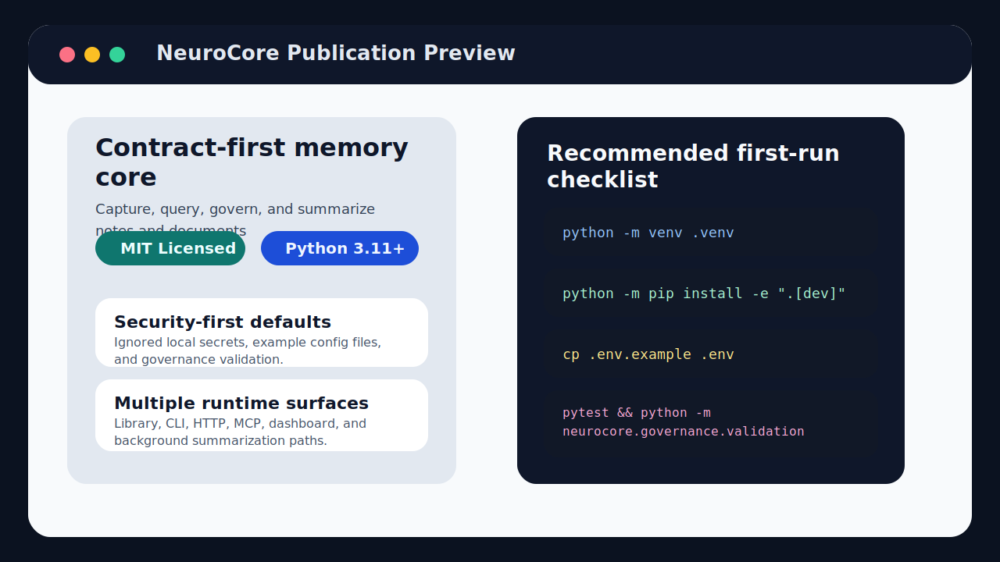
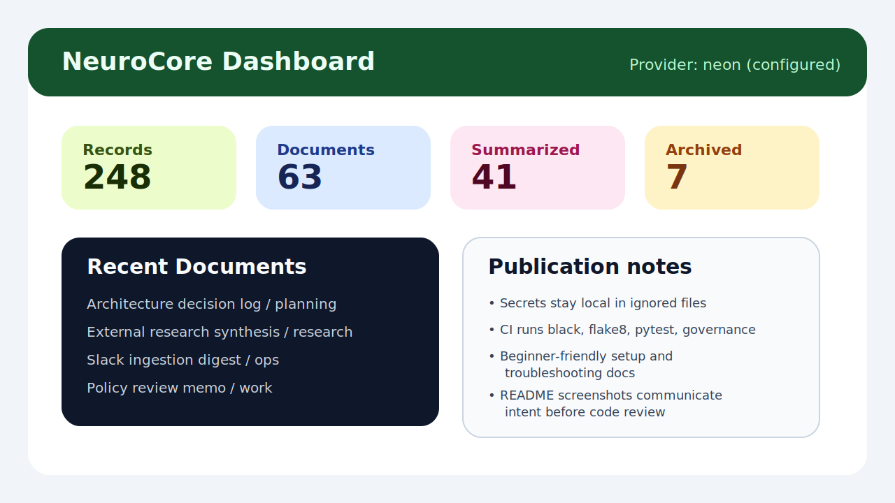

# NeuroCore

[](https://github.com/Shiva108/NeuroCore/blob/main/LICENSE)
[](https://www.python.org/downloads/)
[](https://github.com/Shiva108/NeuroCore/actions/workflows/repo-gate.yml)

NeuroCore is a contract-first memory core for storing atomic notes and long-form
documents with policy-aware retrieval across library, CLI, HTTP, and MCP
surfaces. It is designed to stay understandable for first-time contributors
while still supporting production-minded governance, storage separation, and
security-sensitive workflows.

## Why NeuroCore

- Contract-first architecture grounded in the SSD package under `docs/ssd/`
- Clear runtime boundaries across capture, query, admin, ingestion, and summaries
- Multiple storage paths: in-memory, SQLite, and Postgres-backed routed storage
- Optional dashboard, background summarization, and external consensus features
- Governance checks for required repo artifacts, metadata validation, and obvious
  secret leakage

## Status

The active design source of truth remains:

- `docs/ssd/architecture.md`
- `docs/ssd/specification.md`
- `docs/ssd/implementation-plan.md`
- `docs/ssd/source-matrix.md`

The current package already includes:

- Python package code under `src/neurocore/`
- deterministic and multi-model summarization support
- FastAPI, CLI, and MCP adapter surfaces
- Slack and Discord ingestion adapters
- routed sealed storage support
- admin reindex and governance validation workflows

Use `docs/ssd/source-matrix.md` for traceability between the SSD package,
repository guidance, and external reference material.

## Quick Start

```bash
python3 -m venv .venv
source .venv/bin/activate
python -m pip install --upgrade pip
python -m pip install -e ".[dev]"
cp .env.example .env
cp secrets.json.example secrets.json
cp preferences.json.example preferences.json
pytest
python -m neurocore.governance.validation
```

After installation, the CLI entry point is available as:

```bash
neurocore --help
```

## Security First

NeuroCore is prepared for public GitHub publication, but your credentials are
not part of that publication boundary.

- Never commit `.env`, `token.json`, `secrets.json`, or real database URLs.
- Treat `secrets.json.example` and `preferences.json.example` as safe templates
  only; copy them locally before use.
- Rotate any API key that is pasted into logs, screenshots, or pull requests.
- Run `python -m neurocore.governance.validation` before publishing changes.

## Demo Screenshots

Publication preview:



Dashboard mock:



## Runtime Surfaces

- Library interfaces for capture, query, admin, ingestion, and summary runs
- CLI adapter via `src/neurocore/adapters/cli.py`
- FastAPI adapter via `src/neurocore/adapters/http_api.py`
- MCP adapter via `src/neurocore/adapters/mcp_server.py`
- HTTP ingestion endpoints for Slack and Discord
- Optional `/summaries/run`, `/dashboard`, and `/dashboard/data` routes

## Development Workflow

Primary quality gates:

```bash
black --check src tests
flake8 src tests
pytest
python -m neurocore.governance.validation
```

The repository includes a GitHub Actions workflow that runs the same checks on
push and pull request events.

## Documentation

- [Setup Guide](docs/setup.md)
- [Security Guide](docs/security.md)
- [Troubleshooting](docs/troubleshooting.md)
- [AI-Assisted Setup](docs/ai-assisted-setup.md)
- [Contributing Guide](CONTRIBUTING.md)

## Troubleshooting

Common setup issues are covered in [docs/troubleshooting.md](docs/troubleshooting.md).
The most frequent first-run problems are:

- missing editable install
- incomplete `.env` configuration
- disabled optional surfaces such as admin or dashboard routes
- missing development tools such as `black` or `flake8`

## Repository Layout

- `src/neurocore/` application package
- `tests/` automated tests
- `assets/` static documentation assets and README images
- `docs/` design notes and contributor documentation
- `.github/` CI, PR template, and governance schema files

## License

This project is licensed under the [MIT License](LICENSE).
